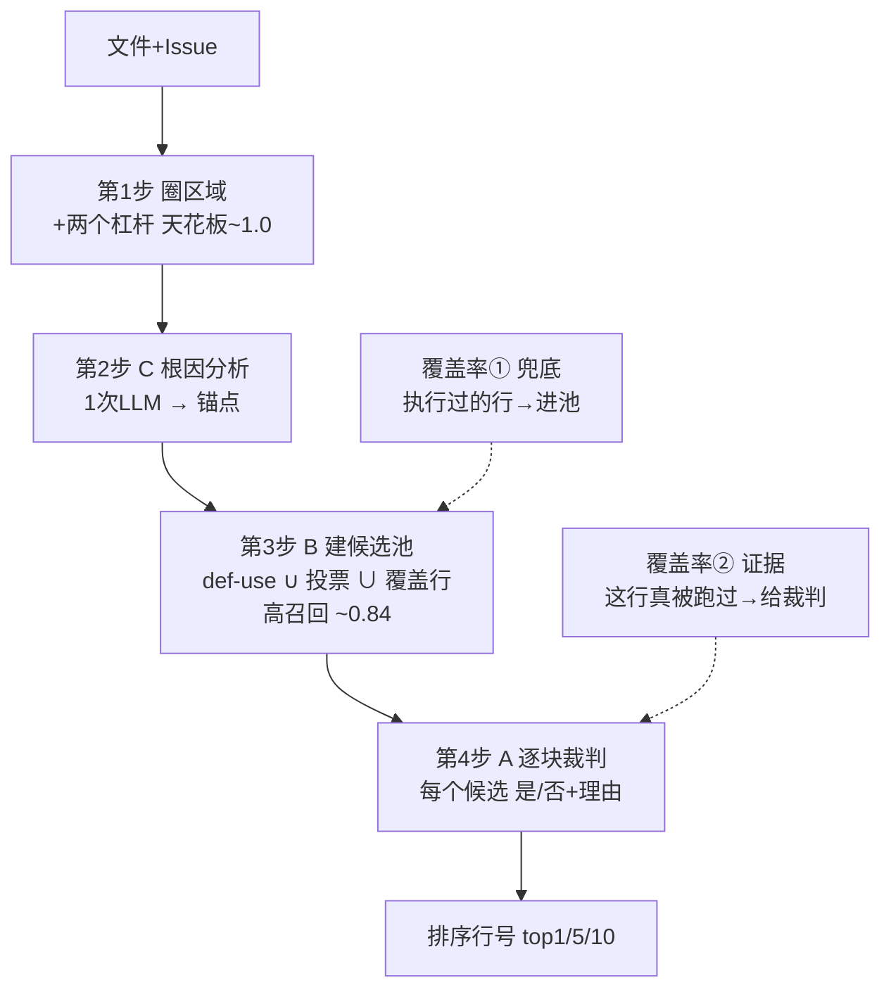

# EGL 科研 Memory —— 无缝交接文档（自包含）

> **给下一个 Claude / 换设备后的我**：读完这一份就能继续工作，不依赖 `~/.claude` 的本地记忆。
> 研究 = **行级故障定位（line-level fault localization）**，对齐 SOTA 基线 **ARISE**。
> 最后更新：2026-06-25。

---

## 🚚 0. 换设备迁移清单（先看）

`prelim_localization/` 当前**未纳入 git**（untracked）。换设备要带的东西：

| 东西 | 怎么带 | 备注 |
|---|---|---|
| 代码 + 文档（`prelim_localization/*.py`, `docs/`） | **git commit + push**，或直接拷贝文件夹 | 必须 |
| `egl_cov_cache.json`（54MB，覆盖率缓存） | 手动拷贝 | 已 gitignore，**重收要 ~250 次 Docker，别丢** |
| `cache/`（142MB，抓取的源码）、`snapshots/`（6GB） | 可选拷贝，**否则会自动重新下载** | 已 gitignore |
| `.key`（API key） | 手动拷贝或重设环境变量 | 已 gitignore，不要提交 |
| 结果 JSON（`egl_e2e_ARISE_static.json` 等） | 随 commit 或拷贝 | 主结果，别丢 |
| AutoDL 上的 bf16 模型 + vLLM | **云端，自动在**（关机/开机即可，见 §6） | 换设备只需重连 SSH 隧道 |

---

## ⚡ 1. 30 秒速览

| 项 | 现状 |
|---|---|
| **研究目标** | 给一个 GitHub issue，定位**该改哪几行**（行级召回 = 唯一目标）|
| **口径（已锁定）** | **file-given（给定正确文件）的 Line Recall@{1,5,10}**；金标定义对齐 ARISE |
| **SOTA 基线** | **ARISE**（arXiv 2605.03117，**闭源**，Qwen2.5-Coder-32B，SWE-bench Lite 300）：line R@{1,5,10}=**41/62/74**，file R@1=67/R@3=82 |
| **我们最新结果** | 完整方法 line **27.7/43.0/47.3**（但在更脏的金标上算的，见 §2.5）|
| **瓶颈** | Stage-2 **投票召回**：金标 78% 在区域内、投票只捞 56%（漏 22 分）|
| **当前主攻** | ①抬区域天花板(已做)→ ②把"盲挑投票"换成"逐块裁判"(**代码已做**，见 §4.1，待小样本验证)→ ③文件定位换 SweRankEmbed 冲 ≥90 |
| **下一步** | **连隧道后先跑 §6.3 的 realize 门**（`region_loc.py --judge`，20 题看 voted_ceiling 0.557→judge R@k）。代码已就绪、门控默认关闭、默认字节级不变（离线 16 项断言通过）。详见 `docs/CBA实现_交接.md` |

---

## 2. 最重要的实验结果

### 2.1 主对比（bf16 Qwen-32B, n=300, file-NOT-given 端到端）
| 配置 | line R@1 | R@5 | R@10 | file R@1 |
|---|---|---|---|---|
| **ARISE 参考** | **41** | **62** | **74** | 67 |
| ours_dynamic（完整方法） | 27.7 | 43.0 | 47.3 | 63.3 |
| ours_static（vote+graph，无覆盖率） | 24.0 | 41.7 | 47.0 | — |
| arise_static（纯静态 def-use 切片，**诚实标注的基线**） | 8.7 | 22.0 | 26.3 | — |

→ 输给 ARISE，差距主要在 R@5/R@10（**召回**，不是排序）。

### 2.2 文件定位（实测，多前端对比）
| 前端 | R@1 | R@3 | R@10 | gold-file recall |
|---|---|---|---|---|
| 我们 ARISE-agent（bf16） | 63.3 | 69.7 | 73.7 | 0.737 |
| 我们 Agentless（AWQ） | 58.6 | 73.7 | 81.8 | **0.818** |
| ARISE 公布 | 67 | 82 | — | — |

**冲 ≥90 方案（已搜+核验，见 `docs/文件定位_冲90方案.md`）**：换 **`Salesforce/SweRankEmbed-Large`**（7B 检索器，公开权重，函数粒度检索→max 聚合到文件）。诚实预期：**R@10 ~0.92–0.94、R@5 ~0.90–0.93、R@1 ~0.70–0.80**。**≥90 只在 k≥5 可达，R@1 到不了 90**（开源方法硬上限）。集成：新建 `swerank_loc.py` + `egl_e2e` 加 `--file-loc swerank` 分支，跑一次冻结。

### 2.3 瓶颈诊断（核心）
- `reg_ceiling=0.784`：金标行落在选中区域内的比例。
- `voted_ceiling=0.557`：投票实际捞到的比例 → **中间漏 22 分**。
- **结构事实**：Stage-2 投票**冻结**候选集，下游（图分/覆盖率/final-pick）**只能重排，不能补漏**。要抬召回必须**扩候选集**，不是重排。
- `cov_on_gold_recall=0.373`：失败测试只执行 37% 的金标行（很多修复是**插入新行**/**没跑到的分支**）→ 覆盖率天生看不到 63%。

### 2.4 R@10 天花板链
```
现状 47.3  →  完美排序当前投票集 57.7  →  完美投票(区域墙) 67.0  →  文件墙 73.7  →  ARISE 74(在文件墙之上)
```
→ 光抬投票召回最多 ~67；要够到 74 还得**同时**抬文件召回（这就是 2.2 的 SweRankEmbed）。

### 2.5 ⭐ 金标定义发现（很重要，对我们有利）
拆 1227 个金标行：**21% 根本不是代码**（空行插入锚点 15.7% + 注释/docstring 5.1%）。因为 `parse_patch` 给插入打的锚点常落在空行上，而 **ARISE 的金标定义明确排除空行**。
→ **我们之前的 27.7/43.0/47.3 是在比 ARISE 更脏、更苛刻的金标上算的，差距被高估了。** 对齐后数字大概率上升。

### 2.6 ⭐ 区域天花板：两个杠杆（已实现+离线验证，见 `docs/区域天花板_两个杠杆.md`）
| 配置 | 区域召回天花板 |
|---|---|
| 现状（脏金标 + 现有区域） | **0.801** |
| + Lever 1（金标对齐 ARISE，扔空行/注释） | **0.896** |
| + Lever 1&2（对齐金标 + 整文件区域） | **1.000** |

### 2.7 def-use 扩候选集（离线验证）
投票集 `voted_ceiling 0.557` → 用 def-use 切片扩展后候选池天花板 **~0.84**，但**重排兑现不出来**（金标是 84 里 1 根针）→ **必须靠"逐块裁判"才能兑现**（见 §3）。

---

## 3. 当前方法设计（A+B+C 组合 + 覆盖率定位）

**核心重构**：把"让 AI 凭感觉列清单"（AI 弱项、漏）换成"让 AI 对每个候选做是非判断"（AI 强项、不漏）。

```
输入：已定位的文件 + Issue
  │
  ▼
[第1步] 圈区域（沿用现有 + §2.6 两个杠杆把天花板抬到 ~1.0）
  │
  ▼
[第2步 = C] 根因分析（1 次 LLM）→ 可疑变量/出错路径 = 锚点
  │
  ▼
[第3步 = B] 建候选池（程序分析，不靠 LLM 想）
            def-use 切片 ∪ 投票并集 ∪ 覆盖行   →  高召回候选池（天花板 ~0.84+）
            ▲                                          覆盖率①：执行过的行 → 加进池子（兜底，救投票全空的 ~32 题）
  │
  ▼
[第4步 = A] 逐块裁判（LLM = 召回引擎）
            对每个候选："要改吗？是/否+理由"，给证据
            ▲                                          覆盖率②："这行真被失败测试跑过" → 当裁判证据
  │
  ▼
输出：排序行号 → top 1/5/10
```



**覆盖率的两个正确位置（不再是 +0.8 打分项）**：①进候选池兜底；②当裁判证据。**诚实：覆盖率只占 37% 金标 → 永远是配角/兜底，不当头条。**

**最大不确定性（命门）**：A 的裁判和投票是同一个 Qwen-32B，会不会有同样盲区？理由上"带证据逐个判断"比"凭空生成"容易、应该能捞回更多，**但必须用实验验证**。次风险：裁判"是"得太多 → 精度崩、R@1 降。**最便宜验证 = 先跑 20 题小样本看裁判把召回从 0.557 推到多少。**

---

## 4. 这次 session 改了哪些代码（全部门控、默认关闭、默认行为不变）

| 改动 | 文件 | 开关 | 作用 |
|---|---|---|---|
| **Lever 1 金标对齐** | `p0_line_recall.clean_gold()` | `egl_e2e --arise-gold`；`ablation_rank_sweep --arise-gold` | 扔空行/注释金标 → 天花板 0.80→0.90，口径对齐 ARISE |
| **Lever 2 不缩区域** | `region_loc._make_region`/`select_regions`（cfg `max_region_lines`/`all_module`） | `egl_e2e --small-file 1800 --max-region 2000 --all-module-lines` | 整文件当区域 → 代码金标天花板 →~1.0 |
| **def-use 扩候选集** | `region_loc._expand_voted()`、`code_graph.stmt_span`/`_stmt_end` | `egl_e2e --grow-depth N --grow-cap M` | 用 def-use 邻居扩投票集（抬 voted_ceiling）|
| **投票不过滤** | `region_loc._vote(region_filter=)` | `egl_e2e --vote-unfiltered` | 收区域外的近邻投票 |
| **离线天花板门** | `ablation_rank_sweep` | `--grow-depth N`（打印 EXPANDED(set) ceiling） | **0 GPU** 验证扩展是否真的抬天花板 |

> ⚠️ 这些抬的是**天花板（必要不充分）**，realized R@k 还要靠下游投票/裁判去兑现。

### 4.1 ⭐ CBA 优化方案落地（2026-06-25 本 session，全部门控、默认字节级不变）
按 `docs/CBA优化方案.md` 实现了 **A 逐块裁判 + B 多视角/覆盖兜底 + C AST 锚点 + 约束解码/logprob 地基**。详见 `docs/CBA实现_交接.md`。

| 段 | 机制 | 落点 | 开关 |
|---|---|---|---|
| 地基 | vLLM 约束解码 + logprob 读 p(Yes) | `region_loc._llm_t(guided=,logprobs=)` | 仅传参才改 payload |
| **A**(realize) | 逐块 GenRM-CoT 是非裁判，p(Yes) 主排序键，RRF 平手，**未判候选保 RRF 序不丢**(召回地板) | `_judge_pool`/`judge_rank`/`_p_yes_from_logprobs`/`_judge_one`；`region_line_loc_ex(rank_mode='judge')` | `--judge` `--judge-cap` `--judge-jury` |
| A3 | cite-then-decide(先逐字 QUOTE，不符则降权) | `_judge_one` | 随裁判 |
| B1 | MoRE 多视角并集投票(symptom/traceback/dataflow/expect) | `_vote(views=)`/`_view_prompt` | `--multi-view` |
| B3 | 覆盖率召回兜底(区域∧执行∧近投票→尾部) | `_coverage_backstop` | `--cov-backstop`(需 `--coverage`) |
| C1 | AST 锚点(LLM 符号→tokenize NAME 硬校验，过滤关键字/builtins/注释词) | `root_cause_anchors`/`_code_identifiers` | `--anchors` |
| 抗幻觉 | 投票强制合法行号 JSON 数组 | `_vote(guided=True)` | `--guided` |
| 驱动 | egl_e2e 加 `ours_judge` 臂 + `summary.judge_realize` | `egl_e2e.process_instance/summarize` | `--judge` |

**验证**：`prelim_localization/cba_smoke_test.py`（mock-LLM，0 GPU，**10/10 组 21 断言通过**）覆盖默认字节级不变/logprob 读数/裁判提升+召回地板/cite/多视角并集/覆盖兜底/guided 门控/锚点 grounding/null-content 不崩/多视角分母正确。
**对抗 review**（`wf_be31980a`，5 维 12 agent）确认无 R1/R2/R3 硬违规；查出并已修 5 个门控路径缺陷（锚点 grounding no-op、多视角投票计数分母、锚点空结果重复调用、null content TypeError）。
**命门未变**：裁判 realize 效果**必须实测**（Qwen-32B 不会自动是好裁判，CBA §7）；先跑 §6.3 的 20 题门。

### 4.2 ⭐ 对抗式补足（多 agent 攻击当前方法，5 维 36 agent，`wf_8f448b26`）
对 §4.1 的方法做对抗式批判：**提 30 个缺口、25 个被对抗验证毙掉**（多是"抬天花板但没排序信号"= def-use 死路的变体），5 个 + 完备性裁判存活。核心发现：**裁判的证据（投票计数=循环、执行标志=不判别、def-use 邻居=已证死的针海信号）都和"冻结候选集的信号"同源——所以 p(Yes) 在最该区分的地方塌成噪声。唯一正交、同模型、推理期的新信号 = 失败测试的断言（expected vs observed）。** 据此补足（全部门控、默认字节级不变、17 组 33 断言通过）：

| 补足 | 机制 | 落点 | 开关 |
|---|---|---|---|
| **SPINE**（realize） | 把失败测试的"期望 vs 现状"喂裁判，问题从"该改吗"重构成 grounded 反事实"这行是否产生/守卫/传播测试检查的值"+ SYMBOL grounding（说不出测试符号的 Yes 降权 = 弱验证器假阳性闸） | `extract_test_evidence` · `JUDGE_PROMPT_TEV` · `_judge_one(test_ev=)` | `--judge-test-ev` |
| **B 召回** | 测试条件化视角：traceback/expect 镜头前置失败测试文本（**新 token**，破 0.557 相关并集饱和） | `_view_prompt`/`_vote(test_ev=)` | `--view-ctx` |
| **B2** | k↑(16-20) + ESC 早停（top 集稳定即停，greedy sample-0 保 R@1） | `_vote(esc=)` · `cfg.k_high` | `--k-high N --esc N` |
| **A 力乘** | 自适应 cap：跳过全票一致行（不调 LLM，给伪高分）+ 按信号分歧排序判更深的池 | `judge_rank(adaptive=)` | `--judge-adaptive` |
| **评测**（关键） | 20 题门加 McNemar 精确检验 + 配对 bootstrap CI + n_discordant + 池大小；**n≤20 只能 fail-fast，绿灯需 n≥60 且 CI 不含 0** | `region_loc.main` summary | 随 `--judge` |

**毙掉的死路**（别再提）：判后校准/listwise 重排/anchor 注入投票/纯覆盖兜底当 realize/judge-the-whole-region 无检索先验——全是"无排序信号"或"撞 def-use 死路"。

---

## 5. 🔧 实验平台使用指南 + 补丁（最关键，逐字照做）

**架构**：实验**本地跑**（Windows，能直连 GitHub），模型**借 AutoDL A800-80** 的 bf16 Qwen2.5-Coder-32B，走 SSH 隧道。覆盖率用**本机 Docker Desktop**。

### 5.1 起 vLLM（AutoDL 终端）
- bf16 模型：`/root/autodl-tmp/qwen32b`（62G）。serve **不要** `--quantization awq`。
- **必打的 torch 补丁（克隆实例会丢，每次重开都要打）**——vLLM 0.23 要 `mm_configs` 这个顶层 import，`--enforce-eager`/环境变量都挡不住，必须改文件：
```bash
python - <<'PY'
import re, pathlib
f = pathlib.Path("/root/miniconda3/lib/python3.10/site-packages/torch/_inductor/kernel/unpack_mixed_mm.py")
bak = f.with_suffix(".py.bak"); src = f.read_text()
if not bak.exists(): bak.write_text(src)
patched = re.sub(r"^from \.mm_common import .*$",
    ("from . import mm_common as _mmc\n"
     "mm_args = getattr(_mmc, 'mm_args', None)\n"
     "mm_grid = getattr(_mmc, 'mm_grid', None)\n"
     "mm_configs = getattr(_mmc, 'mm_configs', lambda *a, **k: [])\n"
     "mm_options = getattr(_mmc, 'mm_options', lambda *a, **k: {})"),
    src, count=1, flags=re.M)
f.write_text(patched); print("PATCHED OK")
PY
```
- 起服务（补丁后）：
```bash
pkill -9 -f vllm ; sleep 3
TORCHDYNAMO_DISABLE=1 TORCH_COMPILE_DISABLE=1 nohup vllm serve /root/autodl-tmp/qwen32b \
  --served-model-name Qwen2.5-Coder-32B --enforce-eager \
  --port 8000 --max-model-len 16384 --gpu-memory-utilization 0.92 > ~/vllm.log 2>&1 &
tail -f ~/vllm.log          # 见 "Application startup complete." 后 Ctrl+C
curl -s http://127.0.0.1:8000/v1/models   # 出 Qwen2.5-Coder-32B = OK
```
（用 nohup 不用 screen；`pkill -f vllm` 别给 screen 起名带 vllm。）

### 5.2 SSH 隧道（本地，CMD 不是 PowerShell）
- **端口每次开实例会变**（上次 = 53664），主机 `connect.nma1.seetacloud.com`，去 AutoDL 控制台查端口：
```
ssh -CN -o ServerAliveInterval=30 -o ServerAliveCountMax=3 -o ExitOnForwardFailure=yes -L 8000:127.0.0.1:8000 -p <端口> root@connect.nma1.seetacloud.com
```
（输密码；窗口卡住=通了，别关。）

### 5.3 覆盖率（动态半边）
- 本机 **Docker Desktop 必须开着**（`docker ps` 能通）。用官方镜像 `swebench/sweb.eval.x86_64.<iid>:latest`。
- **`egl_cov_cache.json` 的 ~250 个已收覆盖率直接复用，别重收**（预收集逻辑会自动跳过非空的）。

### 5.4 公共环境前缀
```
SWEBENCH_DATASET=lite MODEL=Qwen2.5-Coder-32B OPENAI_BASE_URL=http://localhost:8000/v1 OPENAI_API_KEY=dummy
```

### 5.5 成本/持续
- AutoDL 实例**别 release，只关机/开机**（数据盘+模型持久，不用重下）。

---

## 6. 下一步（按优先级）

1. **重算公平基线**：用 `--arise-gold` 重算历史 bf16 结果，看我们 vs ARISE 的"公平差距"（大概率缩小）。
2. **验证两个区域杠杆的 realized 效果**（复用冻结文件定位，不重跑 agentic）：
```bash
<ENV> python egl_e2e.py --broad --sample 300 --workers 20 --file-loc arise \
  --reuse-files egl_e2e_ARISE_static.json --final-pick 8 \
  --arise-gold --small-file 1800 --max-region 2000 --all-module-lines \
  --out egl_e2e_levers.json
```
3. ⭐ **A 裁判 + 对抗补足已实现**（§4.1/§4.2，门控默认关闭）。**连隧道后第一件事 = 跑 realize 门**（file-given，无 Docker，最便宜），**先单跑 SPINE**：
```bash
# 主验证：测试断言喂裁判（对抗裁判判定的最高杠杆）。summary 自带 McNemar + 配对 CI。
<ENV> python region_loc.py --broad --sample 20 --k 5 --judge --judge-test-ev --arise-gold
#   判据：judge_R@5/@10 的 paired_delta CI 不含 0 且不塌 R@1；n≤20 只能 fail-fast，绿灯要 n≥60、跑 ≥3 个投票种子。
# 逐个加杠杆看增量（每个独立门控）：--view-ctx（测试条件化投票）/ --k-high 18 --esc 2（B2）/
#   --judge-adaptive（力乘）/ --multi-view / --anchors / --guided / --judge-jury 3
# 过了再上端到端：egl_e2e.py ... --reuse-files egl_e2e_ARISE_static.json --judge --judge-test-ev --arise-gold
#   （出 ours_judge 臂 + judge_realize 配对 delta；--coverage 时加 --cov-backstop）
```
4. **文件定位换 SweRankEmbed**（§2.2）冲 ≥90，跑一次冻结，之后 `--reuse-files` 复用。
5. **B3 覆盖兜底 + B1 多视角已实现**（§4.1，`--cov-backstop`/`--multi-view`），抬 voted_ceiling，诚实标注覆盖率为配角。

---

## 7. 代码库地图 + 文档索引

**代码**：`prelim_localization/`（18 个 .py 全是活的，扁平布局，**别物理搬**——`p0`/`repo_snapshot`/`egl_e2e` 用 `HERE` 路径绑着 6GB 快照/缓存/.key）。分区见 `prelim_localization/README.md`。核心：`egl_e2e.py`(主驱动)、`region_loc.py`(行定位)、`code_graph.py`(def-use 图)、`p0_line_recall.py`(数据层)、`arise_file_loc.py`/`file_localize.py`(文件定位)、`cov_collect.py`(覆盖率)、`ablation_rank_sweep.py`(离线消融)。

**文档（`docs/`）**：
| 文件 | 内容 |
|---|---|
| **`memory.md`（本文件）** | 总交接，先读这个 |
| `科研讲解_大白话.md` | 从零的通俗讲解（看不懂研究时读）|
| `区域天花板_两个杠杆.md` | §2.6 的细节 |
| `文件定位_冲90方案.md` | §2.2 的细节（SweRankEmbed 集成步骤）|
| **`CBA优化方案.md`** | A/B/C 三段优化方案（前沿技术 + 抗幻觉，含引用）|
| **`CBA实现_交接.md`** | §4.1 的实现交接（改了什么 + 怎么验证 + run 命令）|
| `prelim_localization/cba_smoke_test.py` | CBA 离线 mock 自检（0 GPU，10 组断言；改完先跑）|
| `prelim_localization/6.24实验.md` | 6.24 完整实验记录（平台/补丁/结果原始版）|
| `prelim_localization/RUN_PLAN.md` | 历史 runlist |

**对抗式工作流记录**（同 session 可恢复）：Q3 行定位设计 `wf_461142dd`；文件定位 SOTA 搜索 `wf_2168226b`；CBA 方案综合 `wf_27c4b024`；CBA 实现 review `wf_be31980a`；CBA 方法对抗批判（5 维 36 agent，§4.2）`wf_8f448b26`。

---

## 8. 关键教训 / 别再踩的坑

- **别把代码物理搬进文件夹**：会重指向 6GB 快照/54MB 缓存/.key，触发重下载+重收集+鉴权失败。保持扁平。
- **别把 arise_static 叫"ARISE"**：它只是简化静态切片代理（端到端 8.7 vs ARISE 41），诚实标注"ARISE 风格静态切片基线"。可信度靠①口径对齐对比 ARISE 公布数 + ②冻结文件定位的内部受控消融，**不依赖 1:1 复现**（ARISE 闭源，复现不了）。
- **覆盖率别当打分项**：实测惰性（300 改 1）；只当"进池兜底 + 裁判证据"，且只占 37% 金标，永远配角。
- **重排救不了召回**：投票冻结候选集，下游只能重排。要抬召回必须**扩候选集**或**逐块裁判**。
- **抬天花板 ≠ 抬 R@k**：天花板是必要不充分，realized R@k 还要下游兑现。
- **argparse help 里别放字面 `%`**：会让 `--help` 崩（已踩，已修）。
- **裁判只当 ranker 不当 filter**：判"No"/判失败/超 `--judge-cap` 的候选**按 RRF 序接到尾部，永不删**（`set(judge)==set(v0)`，R@∞ 天花板不变）。这是召回地板，别改成删除式过滤。
- **多视角投票的 counts 跨镜头累加**：`_vote(views=...)` 每个镜头各加一次 → counts 上限 = k×视角数。喂裁判证据"N/k"时分母要 ×视角数（否则出"8/5"，已修）。
- **锚点 grounding 用 `tokenize` 的 NAME token**，别用 `re.findall`：后者会把注释/字符串里的英文词和关键字（if/return/value）当成"真符号"，让抗幻觉校验形同虚设（已踩，已修，见 `region_loc._code_identifiers`）。
- **vLLM 读 p(Yes)**：`logprobs=true, top_logprobs=N` → 从 `choices[0].logprobs.content` 里**最后一个** verdict token 的 `top_logprobs` 做 Yes/No softmax；`message.content` 可能是 `null`（reasoning/refusal）→ 必须 `or ""` 兜底（已修）。`guided_json`/`guided_choice` 直接放 request body 顶层（vLLM XGrammar 认）。
